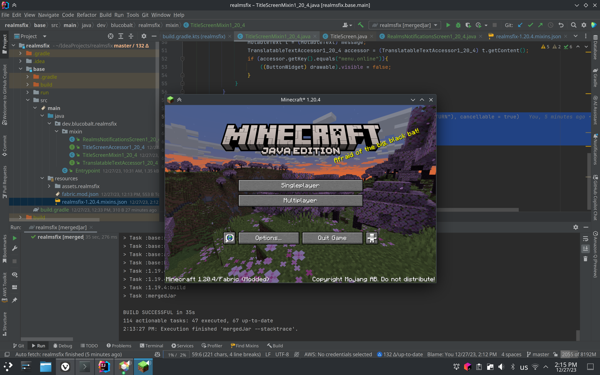

# Realms Button Remover
## realmsfix
simple mod for fabric that removes the realms button from the main menu

The same file works for every major version since 1.7.10, using Legacy Fabric.

# Building
Run `gradlew mergedJar` from the main source directory to build, when complete, the file will be in `build/mergedJars/`

# License
realmsfix is free software; you can redistribute it and/or modify
it under the terms of the GNU Lesser General Public License as published by
the Free Software Foundation; either version 2.1 of the License, or
(at your option) any later version.

realmsfix is distributed in the hope that it will be useful,
but WITHOUT ANY WARRANTY; without even the implied warranty of
MERCHANTABILITY or FITNESS FOR A PARTICULAR PURPOSE.  See the
GNU Lesser General Public License for more details.

You should have received a copy of the GNU Lesser General Public License
along with realmsfix.  If not, see <http://www.gnu.org/licenses/>.
